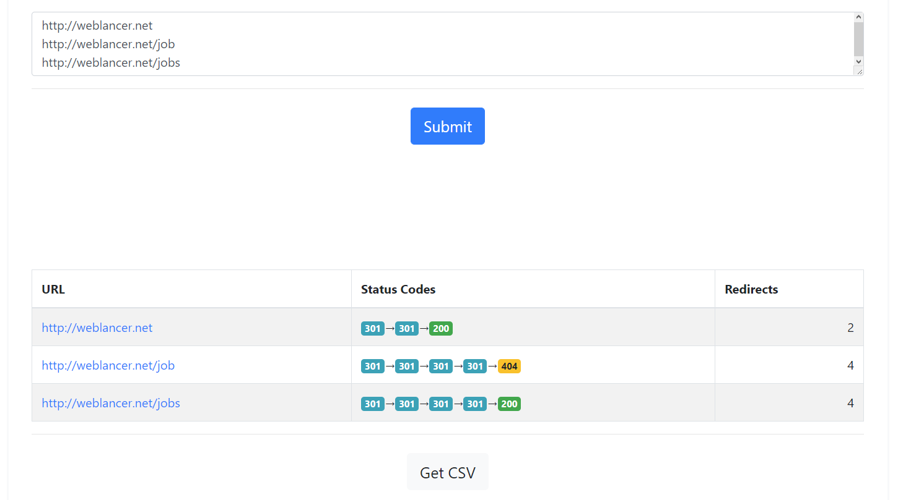

# Сервис проверки URL и получения редиректов
Сервис проверки URL и получение редиректа.
Возможности:
- ввод множество URL с новой строки;
- проверка URL;
- получение статусов страницы;
- получение кол. редиректов;
- получение результата в JSON и отображение в таблице;
- распечатка результата в CSV файл;
- работает на php 5 и выше.

